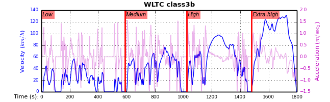
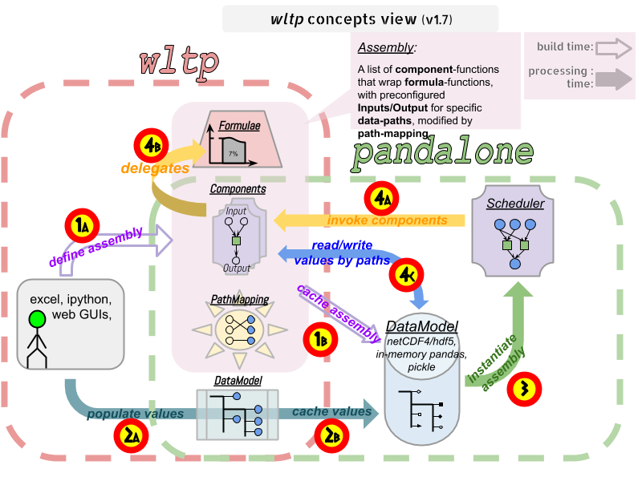
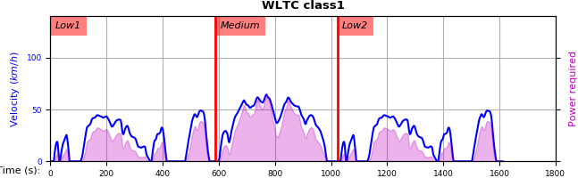
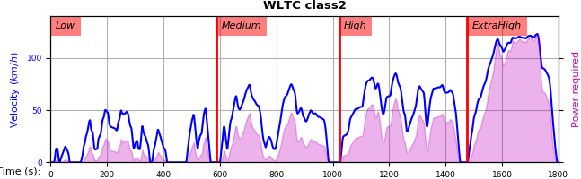

################################################################
wltp: generate WLTC gear-shifts based on vehicle characteristics
################################################################
:versions:      |pypi-version| |conda-version| |gh-version| |proj-version| |rel-date|
                (build-version: |release|, build-date: |today|)
                |dev-status| |python-ver|  |conda-plat|
:documentation: https://wltp.readthedocs.org/ |br|
                |docs-status|
:live-demo:     |binder| |binder-dev|
:sources:       https://github.com/JRCSTU/wltp |br|
                |travis-status| |appveyor-status| |downloads-count| |codestyle| |br|
                |gh-watch| |gh-star| |gh-fork| |gh-issues|
:keywords:      UNECE, automotive, car, cars, driving, engine, emissions, fuel-consumption,
                gears, gearshifts, rpm, simulation, simulator, standard, vehicle, vehicles, WLTC, NEDC
:copyright:     2013-2020 European Commission (`JRC-IET <https://ec.europa.eu/jrc/en/institutes/iet>`_) |br|
                |proj-lic|

A python-3.6+ package to generate the *gear-shifts* of Light-duty vehicles
running the :term:`WLTP` driving-cycles, according to :term:`UNECE`'s :term:`GTR`\s.

    **Figure 1:** :ref:`annex-2:cycles` for class-3b Vehicles

.. Attention::
    This *wltp* python project is still in *alpha* stage, in the sense that
    its results are not "correct" by the standard, and no WLTP dyno-tests should rely
    currently on them.

    Some of the known limitations are described in these places:

    * In the :doc:`CHANGES`.
    * Compare results with AccDB in ``Notebooks/CarsDB-compare.ipynb`` notebook;
      launch your private *demo-server* (|binder|) to view it.

.. _end-opening:
.. contents:: Table of Contents
  :backlinks: top
.. _begin-intro:

Introduction
============

Overview
--------
The calculator accepts as input the vehicle's technical data, along with parameters for modifying the execution
of the :term:`WLTC` cycle, and it then spits-out the gear-shifts of the vehicle, the attained speed-profile,
and any warnings.  It does not calculate any |CO2| emissions.

An "execution" or a "run" of an experiment is depicted in the following diagram::

                .-----------------.                         .------------------.
                :      Input      :                         :      Output      :
                ;-----------------;                         ;------------------;
               ; +--test_mass    ;     ____________        ; +--pmr           ;
              ;  +--n_idle      ;     |            |      ;  +--wltc_class   ;
             ;   +--f0,f1,f2   ;  ==> |   Cycle    | ==> ;   +--...         ;
            ;    +--wot/      ;       | Generator  |    ;    +--cycle      ;
           ;         +--     ;        |____________|   ;     |    +--     ;
          ;      +--n2vs    ;                         ;      +--gwots    ;
         ;           +--   ;                         ;            +--   ;
        '-----------------'                         '------------------'

The *Input*, *Output* and all its contents are instances of :term:`datamodel`
(trees of strings, numbers & pandas objects)

Quick-start
-----------
- Launch the example *jupyter notebooks* in a private *demo server* (|binder|).
- Otherwise, install it locally, preferably from the sources (instructions below).
- ``pip install`` :abbr:`"extras" (e.g. pip install wltp[all])`:

  - ``plot, excel, all, dev, notebook, test, doc``

Prerequisites:
^^^^^^^^^^^^^^
**Python-3.6+** is required and **Python-3.7** or **Python-3.8** recommended.
It requires **numpy/scipy** and **pandas** libraries with native backends.

.. Tip::
    On *Windows*, it is preferable to use the `miniconda <https://docs.conda.io/en/latest/miniconda.html>`_
    distribution; although its `conda` command adds another layer of complexity on top of ``pip``,
    unlike standard Python, it has pre-built all native libraries required
    (e.g. **numpy/scipy** and **pandas**).

    If nevertheless you choose the *standard Python*, and some packages fail to build when `pip`-installing them,
    download these packages from `Gohlke's "Unofficial Windows Binaries"
    <https://www.lfd.uci.edu/~gohlke/pythonlibs/>`_ and install them manually with::

        pip install <package-file-v1.2.3.whl>

Download:
^^^^^^^^^
Download the sources,

- either with *git*, by giving this command to the terminal::

      git clone https://github.com/JRCSTU/wltp/ --depth=1

- or download and extract the project-archive from the release page:
  https://github.com/JRCSTU/wltp/archive/v1.1.0.dev0.zip

Install:
^^^^^^^^
From within the project directory, run one of these commands to install it:

- for standard python, installing with ``pip`` is enough (but might)::

      pip install -e .[test]

- for *conda*, prefer to install the conda-packages listed in :file:`Notebooks/conda/conda-reqs.txt`,
  before running the same `pip` command, like this::

      conda install  --override-channels -c ankostis -c conda-forge -c defaults --file Notebooks/conda/conda-reqs.txt
      pip install -e .[dev]

- Check installation:

  .. code-block:: bash

      $ wltp --version
      ...

      $ wltp --help
      ...

    See: :ref:`wltp-usage`

- Recreate jupyter notebooks from the paired ``*.py`` "py:percent" files
  (only these files are stored in git-repo),
  by executing the bash-script::

      Notebooks/recreate_ipynbs.sh

- Run pyalgo on all AccDB cars to re-create the H5 file
  needed for ``CarsDB-compare`` notebook, etc::

      Notebooks/recreate_pyalgo_h5.sh

Usage:
^^^^^^
.. code-block:: python

    import pandas as pd
    from wltp import datamodel
    from wltp.experiment import Experiment

    inp_mdl = datamodel.get_model_base()
    inp_mdl.update({
        "unladen_mass": None,
        "test_mass": 1100,  # in kg
        "p_rated": 95.3,  # in kW
        "n_rated": 3000,  # in RPM
        "n_idle": 600,
        "n2v_ratios": [122.88, 75.12, 50.06, 38.26, 33.63],

        ## For giving absolute P numbers,
        #  rename `p_norm` column to `p`.
        #
        "wot": pd.DataFrame(
            [[600, 0.1],
            [2500, 1],
            [3500, 1],
            [5000, 0.7]], columns=["n", "p_norm"]
        ),
        'f0': 395.78,
        'f1': 0,
        'f2': 0.15,
    })
    datamodel.validate_model(inp_mdl, additional_properties=True)
    exp = Experiment(inp_mdl, skip_model_validation=True)

    # exp = Experiment(inp_mdl)
    out_mdl = exp.run()
    print(f"Available values: \n{list(out_mdl.keys())}")
    print(f"Cycle: \n{out_mdl['cycle']}")

See: :ref:`python-usage`

Project files and folders
-------------------------
The files and folders of the project are listed below (see also :ref:`architecture:Architecture`)::

    +--bin/                     # (shell-scripts) Utilities & preprocessing of WLTC data on GTR and the wltp_db
    |   +--bumpver.py           # (script) Update project's version-string
    +--wltp/                    # (package) python-code of the calculator
    |   +--cycles/              # (package) code & data for the WLTC data
    |   +--experiment           # top-level code running the algo
    |   +--datamodel            # schemas & defaults for data of algo
    |   +--cycler               # code for generating the cycle
    |   +--engine               # formulae for engine power & revolutions and gear-box
    |   +--vehicle              # formulae for cycle/vehicle dynamics
    |   +--vmax                 # formulae estimating `v_max` from wot
    |   +--downscale            # formulae downscaling cycles based on pmr/test_mass ratio
    |   +--invariants           # definitions & idempotent formulae for physics/engineering
    |   +--io                   # utilities for starting-up, parsing, naming and spitting data
    |   +--utils                # software utils unrelated to physics or engineering
    |   +--cli                  # (OUTDATED) command-line entry-point for launching this wltp tool
    |   +--plots                # (OUTDATED) code for plotting diagrams related to wltp cycles & results
    |   +--idgears              # (OUTDATED) reconstructs the gears-profile by identifying the actual gears
    +--tests/                   # (package) Test-TestCases
        +--vehdb                # Utils for manipulating h5db with accdb & pyalgo cases.
    +--docs/                    # (folder) documentation
    |   +--pyplots/             # (DEPRECATED by notebooks) scripts plotting the metric diagrams embedded in the README
    +--Notebooks/               # Jupyter notebooks for running & comparing results (see `Notebooks/README.md`)
        +--AccDB_src/           # AccDB code & queries extracted and stored as text
    +--setup.py                 # (script) The entry point for `setuptools`, installing, testing, etc
    +--requirements/            # (txt-files) Various pip-dependencies for tools.
    +--README.rst
    +--CHANGES.rst
    +--LICENSE.txt

.. _wltp-usage:

Usage
=====
.. _python-usage:

Python usage
------------
First run :command:`python` or :command:`ipython` :abbr:`REPL (Read-Eval-Print Loop)` and
try to import the project to check its version:

.. doctest::

    >>> import wltp

    >>> wltp.__version__            ## Check version once more.
    '1.1.0.dev0'

    >>> wltp.__file__               ## To check where it was installed.         # doctest: +SKIP
    /usr/local/lib/site-package/wltp-...

.. Tip:
    The use :command:`ipython` is preferred over :command:`python` since it offers various user-friendly
    facilities, such as pressing :kbd:`Tab` for completions, or allowing you to suffix commands with ``?`` or ``??``
    to get help and read their source-code.

    Additionally you can <b>copy any python commands starting with ``>>>`` and ``...``</b> and copy paste them directly
    into the ipython interpreter; it will remove these prefixes.
    But in :command:`python` you have to remove it yourself.

If everything works, create the :term:`datamodel` of the experiment.
You can assemble the model-tree by the use of:

* sequences,
* dictionaries,
* :class:`pandas.DataFrame`,
* :class:`pandas.Series`, and
* URI-references to other model-trees.

For instance:

.. doctest::

    >>> from wltp import datamodel
    >>> from wltp.experiment import Experiment

    >>> mdl = {
    ...     "unladen_mass": 1430,
    ...     "test_mass":    1500,
    ...     "v_max":        195,
    ...     "p_rated":      100,
    ...     "n_rated":      5450,
    ...     "n_idle":       950,
    ...     "n_min":        None,                           ## Manufacturers my override it
    ...     "n2v_ratios":         [120.5, 75, 50, 43, 37, 32],
    ...     "f0":   100,
    ...     "f1":   0.5,
    ...     "f2":   0.04,
    ... }
    >>> mdl = datamodel.upd_default_load_curve(mdl)                   ## need some WOT

For information on the accepted model-data, check the :ref:`code:Schemas`:

.. doctest::

    >>> from wltp import utils
    >>> utils.yaml_dumps(datamodel.model_schema(), indent=2)                                # doctest: +SKIP
    $schema: http://json-schema.org/draft-07/schema#
    $id: /wltc
    title: WLTC data
    type: object
    additionalProperties: false
    required:
    - classes
    properties:
    classes:
    ...

You then have to feed this model-tree to the :class:`~wltp.experiment.Experiment`
constructor. Internally the :class:`pandalone.pandel.Pandel` resolves URIs, fills-in default values and
validates the data based on the project's pre-defined :term:`JSON-schema`:

.. doctest::

    >>> processor = Experiment(mdl)         ## Fills-in defaults and Validates model.

Assuming validation passes without errors, you can now inspect the defaulted-model
before running the experiment:

.. doctest::

    >>> mdl = processor.model               ## Returns the validated model with filled-in defaults.
    >>> sorted(mdl)                         ## The "defaulted" model now includes the `params` branch.
    ['driver_mass', 'f0', 'f1', 'f2', 'f_dsc_decimals', 'f_dsc_threshold', 'f_inertial',
     'f_n_clutch_gear2', 'f_n_min', 'f_n_min_gear2', 'f_running_threshold', 'f_safety_margin',
     'f_up_threshold', 'n2v_ratios', 'n_idle', 'n_min_drive1', 'n_min_drive2', 'n_min_drive2_stopdecel',
     'n_min_drive2_up', 'n_min_drive_down', 'n_min_drive_down_start', 'n_min_drive_set',
     'n_min_drive_up', 'n_min_drive_up_start', 'n_rated', 'p_rated', 't_cold_end', 'test_mass',
     'unladen_mass', 'v_cap', 'v_max', 'v_stopped_threshold', 'wltc_data', 'wot']

Now you can run the experiment:

.. doctest::

    >>> mdl = processor.run()               ## Runs experiment and augments the model with results.
    >>> sorted(mdl)                         ## Print the top-branches of the "augmented" model.
    [`cycle`, 'driver_mass', 'f0', 'f1', 'f2', `f_dsc`, 'f_dsc_decimals', `f_dsc_raw`,
     'f_dsc_threshold', 'f_inertial', 'f_n_clutch_gear2', 'f_n_min', 'f_n_min_gear2',
     'f_running_threshold', 'f_safety_margin', 'f_up_threshold', `g_vmax`, `is_n_lim_vmax`,
     'n2v_ratios', `n95_high`, `n95_low`, 'n_idle', `n_max`, `n_max1`, `n_max2`, `n_max3`,
     'n_min_drive1', 'n_min_drive2', 'n_min_drive2_stopdecel', 'n_min_drive2_up', 'n_min_drive_down',
     'n_min_drive_down_start', 'n_min_drive_set', 'n_min_drive_up', 'n_min_drive_up_start',
     'n_rated', `n_vmax`, 'p_rated', `pmr`, 't_cold_end', 'test_mass', 'unladen_mass', 'v_cap',
     'v_max', 'v_stopped_threshold', `wltc_class`, 'wltc_data', 'wot', `wots_vmax`]

To access the time-based cycle-results it is better to use a :class:`pandas.DataFrame`:

.. doctest::

    >>> import pandas as pd, wltp.cycler as cycler, wltp.io as wio
    >>> df = pd.DataFrame(mdl['cycle']); df.index.name = 't'
    >>> df.shape                            ## ROWS(time-steps) X COLUMNS.
    (1801, 107)
    >>> wio.flatten_columns(df.columns)
    ['t', 'V_cycle', 'v_target', 'a', 'phase_1', 'phase_2', 'phase_3', 'phase_4', 'accel_raw',
     'run', 'stop', 'accel', 'cruise', 'decel', 'initaccel', 'stopdecel', 'up', 'p_inert', 'n/g1',
     'n/g2', 'n/g3', 'n/g4', 'n/g5', 'n/g6', 'n_norm/g1', 'n_norm/g2', 'n_norm/g3', 'n_norm/g4',
     'n_norm/g5', 'n_norm/g6', 'p/g1', 'p/g2', 'p/g3', 'p/g4', 'p/g5', 'p/g6', 'p_avail/g1',
     'p_avail/g2', 'p_avail/g3', 'p_avail/g4', 'p_avail/g5', 'p_avail/g6', 'p_avail_stable/g1',
     'p_avail_stable/g2', 'p_avail_stable/g3', 'p_avail_stable/g4', 'p_avail_stable/g5',
     'p_avail_stable/g6', 'p_norm/g1', 'p_norm/g2', 'p_norm/g3', 'p_norm/g4', 'p_norm/g5',
     'p_norm/g6', 'p_resist', 'p_req', 'P_remain/g1', 'P_remain/g2', 'P_remain/g3',
     'P_remain/g4', 'P_remain/g5', 'P_remain/g6', 'ok_p/g3', 'ok_p/g4', 'ok_p/g5', 'ok_p/g6',
     'ok_gear0/g0', 'ok_max_n/g1', 'ok_max_n/g2', 'ok_max_n/g3', 'ok_max_n/g4', 'ok_max_n/g5',
     'ok_max_n/g6', 'ok_min_n_g1/g1', 'ok_min_n_g1_initaccel/g1', 'ok_min_n_g2/g2',
     'ok_min_n_g2_stopdecel/g2', 'ok_min_n_g3plus_dns/g3', 'ok_min_n_g3plus_dns/g4',
     'ok_min_n_g3plus_dns/g5', 'ok_min_n_g3plus_dns/g6', 'ok_min_n_g3plus_ups/g3',
     'ok_min_n_g3plus_ups/g4', 'ok_min_n_g3plus_ups/g5', 'ok_min_n_g3plus_ups/g6', 'ok_n/g1',
     'ok_n/g2', 'ok_n/g3', 'ok_n/g4', 'ok_n/g5', 'ok_n/g6', 'ok_gear/g0', 'ok_gear/g1',
     'ok_gear/g2', 'ok_gear/g3', 'ok_gear/g4', 'ok_gear/g5', 'ok_gear/g6', 'G_scala/g0', 'G_scala/g1',
     'G_scala/g2', 'G_scala/g3', 'G_scala/g4', 'G_scala/g5', 'G_scala/g6', 'g_min', 'g_max0']
    >>> 'Mean engine_speed: %s' % df.n.mean()                                       # doctest: +SKIP
    'Mean engine_speed: 1908.9266796224322'
    >>> df.describe()                                                               # doctest: +SKIP
               v_class     v_target  ...     rpm_norm       v_real
    count  1801.000000  1801.000000  ...  1801.000000  1801.000000
    mean     46.361410    46.361410  ...     0.209621    50.235126
    std      36.107745    36.107745  ...     0.192395    32.317776
    min       0.000000     0.000000  ...    -0.205756     0.200000
    25%      17.700000    17.700000  ...     0.083889    28.100000
    50%      41.300000    41.300000  ...     0.167778    41.300000
    75%      69.100000    69.100000  ...     0.285556    69.100000
    max     131.300000   131.300000  ...     0.722578   131.300000
    <BLANKLINE>
    [8 rows x 10 columns]

    >>> processor.driveability_report()                                             # doctest: +SKIP
    ...
      12: (a: X-->0)
      13: g1: Revolutions too low!
      14: g1: Revolutions too low!
    ...
      30: (b2(2): 5-->4)
    ...
      38: (c1: 4-->3)
      39: (c1: 4-->3)
      40: Rule e or g missed downshift(40: 4-->3) in acceleration?
    ...
      42: Rule e or g missed downshift(42: 3-->2) in acceleration?
    ...

You can export the cycle-run results in a CSV-file with the following pandas command:

.. code-block:: pycon

    >>> df.to_csv('cycle.csv')                                                      # doctest: +SKIP

For more examples, download the sources and check the test-cases
found under the :file:`/tests/` folder.

.. _cmd-line-usage:

Cmd-line usage
--------------
.. Warning:: Not implemented in yet.

The command-line usage below requires the Python environment to be installed, and provides for
executing an experiment directly from the OS's shell (i.e. :program:`cmd` in windows or :program:`bash` in POSIX),
and in a *single* command.  To have precise control over the inputs and outputs
(i.e. experiments in a "batch" and/or in a design of experiments)
you have to run the experiments using the API python, as explained below.

The entry-point script is called :program:`wltp`, and it must have been placed in your :envvar:`PATH`
during installation.  This script can construct a *model* by reading input-data
from multiple files and/or overriding specific single-value items. Conversely,
it can output multiple parts of the resulting-model into files.

To get help for this script, use the following commands:

.. code-block:: bash

    $ wltp --help                               ## to get generic help for cmd-line syntax
    $ wltcmdp.py -M vehicle/full_load_curve     ## to get help for specific model-paths

and then, assuming ``vehicle.csv`` is a CSV file with the vehicle parameters
for which you want to override the ``n_idle`` only, run the following:

.. code-block:: bash

    $ wltp -v \
        -I vehicle.csv file_frmt=SERIES model_path=params header@=None \
        -m vehicle/n_idle:=850 \
        -O cycle.csv model_path=cycle

.. _excel-usage:

Excel usage
-----------
.. Attention:: OUTDATED!!! Excel-integration requires Python 3 and *Windows* or *OS X*!

In *Windows* and *OS X* you may utilize the excellent `xlwings <http://xlwings.org/quickstart/>`_ library
to use Excel files for providing input and output to the experiment.

To create the necessary template-files in your current-directory you should enter:

.. code-block:: shell

     $ wltp --excel

You could type instead :samp:`wltp --excel {file_path}` to specify a different destination path.

In *windows*/*OS X* you can type :samp:`wltp --excelrun` and the files will be created in your home-directory
and the excel will open them in one-shot.

All the above commands creates two files:

:file:`wltp_excel_runner.xlsm`
    The python-enabled excel-file where input and output data are written, as seen in the screenshot below:

    .. image:: docs/xlwings_screenshot.png
        :scale: 50%
        :alt: Screenshot of the `wltp_excel_runner.xlsm` file.

    After opening it the first tie, enable the macros on the workbook, select the python-code at the left and click
    the :menuselection:`Run Selection as Python` button; one sheet per vehicle should be created.

    The excel-file contains additionally appropriate *VBA* modules allowing you to invoke *Python code*
    present in *selected cells* with a click of a button, and python-functions declared in the python-script, below,
    using the ``mypy`` namespace.

    To add more input-columns, you need to set as column *Headers* the *json-pointers* path of the desired
    model item (see :ref:`python-usage` below,).

:file:`wltp_excel_runner.py`
    Utility python functions used by the above xls-file for running a batch of experiments.

    The particular functions included reads multiple vehicles from the input table with various
    vehicle characteristics and/or experiment parameters, and then it adds a new worksheet containing
    the cycle-run of each vehicle .
    Of course you can edit it to further fit your needs.

.. Note:: You may reverse the procedure described above and run the python-script instead.
    The script will open the excel-file, run the experiments and add the new sheets, but in case any errors occur,
    this time you can debug them, if you had executed the script through *LiClipse*, or *IPython*!

Some general notes regarding the python-code from excel-cells:

* On each invocation, the predefined VBA module ``pandalon`` executes a dynamically generated python-script file
  in the same folder where the excel-file resides, which, among others, imports the "sister" python-script file.
  You can read & modify the sister python-script to import libraries such as 'numpy' and 'pandas',
  or pre-define utility python functions.
* The name of the sister python-script is automatically calculated from the name of the Excel-file,
  and it must be valid as a python module-name.  Therefore do not use non-alphanumeric characters such as
  spaces(`` ``), dashes(``-``) and dots(``.``) on the Excel-file.
* On errors, a log-file is written in the same folder where the excel-file resides,
  for as long as **the message-box is visible, and it is deleted automatically after you click 'ok'!**
* Read http://docs.xlwings.org/quickstart.html

.. _architecture:

Architecture
============
The Python code is highly modular, with `testability in mind
<https://en.wikipedia.org/wiki/Test-driven_development>`_.
so that specific parts can run in isolation.
This facilitates studying tough issues, such as, `double-precision reproducibility
<https://gist.github.com/ankostis/895ba33f05a5a76539cb689a2f366230>`_, boundary conditions,
comparison of numeric outputs, and studying the code in sub-routines.

.. tip::
    Run test-cases with ``pytest`` command.

Data Structures:
----------------
.. default-role:: term

Computations are vectorial, based on `hierarchical dataframes
<https://pandas.pydata.org/pandas-docs/stable/user_guide/advanced.html>`_,
all of them stored in a single structure, the `datamodel`.
In case the computation breaks, you can still retrieve all intermediate results
till that point.

.. TODO::
    Almost all of the names of the `datamodel` and `formulae` can be remapped,
    For instance, it is possible to run the tool on data containing ``n_idling_speed``
    instead of ``n_idle`` (which is the default), without renaming the input data.

.. glossary::

    mdl
    datamodel
        The container of all the scalar Input & Output values, the WLTC constants factors,
        and 3 matrices: `WOT`, `gwots`, and the `cycle run` time series.

        It is composed by a stack of mergeable `JSON-schema` abiding trees of *string, numbers & pandas objects*,
        formed with python *sequences & dictionaries, and URI-references*.
        It is implemented in :mod:`~wltp.datamodel`, supported by :class:`pandalone.pandata.Pandel`.

    WOT
    Full Load Curve
        An *input* array/dict/dataframe with the full load power curves for (at least) 2 columns for ``(n, p)``
        or their normalized values ``(n_norm, p_norm)``.
        See also https://en.wikipedia.org/wiki/Wide_open_throttle

    gwots
    grid WOTs
        A dataframe produced from `WOT` for all gear-ratios, indexed by a grid of rounded velocities,
        and with 2-level columns ``(item, gear)``.
        It is generated by :func:`~wltp.engine.interpolate_wot_on_v_grid()`, and augmented
        by :func:`~wltp.engine.attach_p_avail_in_gwots()` & :func:`~wltp.vehicle.calc_p_resist()` .

        .. TODO::
            Move `grid WOTs` code in own module :mod:`~wltp.gwots`.

    cycle
    cycle run
        A dataframe with all the time-series, indexed by the time of the samples.
        The velocities for each time-sample must exist in the `gwots`.
        The columns are the same 2-level columns like *gwots*.
        it is implemented in :mod:`~wltp.cycler`.

Code Structure:
---------------
The computation code is roughly divided in these python modules:

.. glossary::

    formulae
        Physics and engineering code, implemented in modules:

        - :mod:`~wltp.engine`
        - :mod:`~wltp.vmax`
        - :mod:`~wltp.downscale`
        - :mod:`~wltp.vehicle`

    - orchestration
        The code producing the actual gear-shifting, implemented in modules:

        - :mod:`~wltp.datamodel`
        - :mod:`~wltp.cycler`
        - :mod:`~wltp.gridwots` (TODO)
        - :mod:`~wltp.scheduler` (TODO)
        - :mod:`~wltp.experiment` (TO BE DROPPED, :mod:`~wltp.datamodel` will assume all functionality)

    scheduler
    graphtik
        The internal software component :mod:`graphtik` which decides which
        `formulae` to execute based on given inputs and requested outputs.

The blueprint for the underlying software ideas is given with this diagram:

Note that currently there is no `scheduler` component, which will allow to execute the tool
with a varying list of available inputs & required data, and automatically compute
only what is not already given.

Specs & Algorithm
-----------------
This program imitates to some degree the  `MS Access DB` (as of July 2019),
following  this *08.07.2019_HS rev2_23072019 GTR specification*
(:download:`docs/_static/WLTP-GS-TF-41 GTR 15 annex 1 and annex 2 08.07.2019_HS rev2_23072019.docx`,
included in the :file:`docs/_static` folder).

.. Note::
    There is a distinctive difference between this implementation and the `AccDB`:

    All computations are *vectorial*, meaning that all intermediate results are calculated & stored,
    for all time sample-points,
    and not just the side of the conditions that evaluate to *true* on each sample.

The latest official version of this GTR, along
with other related documents maybe found at UNECE's site:

* http://www.unece.org/trans/main/wp29/wp29wgs/wp29grpe/grpedoc_2013.html
* https://www2.unece.org/wiki/pages/viewpage.action?pageId=2523179

.. default-role:: obj
.. _begin-cycles:

Cycles
======
The WLTC-profiles for the various classes were generated from the tables
of the specs above using the :file:`devtools/csvcolumns8to2.py` script, but it still requires
an intermediate manual step involving a spreadsheet to copy the table into ands save them as CSV.

.. _phasings:

Phases (the problem)
--------------------
GTR's "V" phasings
^^^^^^^^^^^^^^^^^^
The :term:`GTR`'s velocity traces have overlapping split-time values, i.e. belonging to 2 phases,
and e.g. for *class1* these are the sample-values @ times 589 & 1022:

.. table:: GTR's **"V"** phasing scheme for Velocities

    ============  ========  ===========  ============  =========
      *class1*     phase-1     phase-2      phase-3     *cycle*
    ============  ========  ===========  ============  =========
    Boundaries    [0, 589]  [589, 1022]  [1022, 1611]  [0, 1611]
    Duration      589       433          589           1611
    # of samples  590       434          590           1612
    ============  ========  ===========  ============  =========

"Semi-VA" phasings
^^^^^^^^^^^^^^^^^^
Some programs and most spreadsheets do not handle overlapping split-time values
like that (i.e. keeping a separate column for each class-phase),
and assign split-times either to the earlier or the later phase, distorting thus
the duration & number of time samples some phases contain!

For instance, Access-DB tables assign split-times on the lower parts,
distorting the start-times & durations for all phases except the 1st one
(deviations from GTR **in bold**):

.. table::
    Access-DB, a **"semi-VA1"** phasing scheme (all but 1st phases shorter)

    ============  ========  ===============  ================      =========
      *class1*    phase-1       phase-2          phase-3            *cycle*
    ============  ========  ===============  ================      =========
    Boundaries    [0, 589]  [**590**, 1022]  [**1023**, 1611]      [0, 1611]
    Duration      589       **432**          **588**               1611
    # of samples  590       **433**          **589**               1612
    ============  ========  ===============  ================      =========

.. Note::
    The algorithms contained in Access DB are carefully crafted to do the right thing.

The inverse distortion (assigning split-times on the higher parts) would preserve
phase starting times (hint: downscaling algorithm depends on those absolute timings
being precisely correct):

.. table::
    "Inverted" Access-DB, a **"semi-VA0"** phasing schema (all but last phases shorter)

    =============  ===============  ===============  ================  =========
      *class1*         phase-1          phase-2           phase-3       *cycle*
    =============  ===============  ===============  ================  =========
    Boundaries     [0, **588**]     [589, **1021**]  [1022, 1611]      [0, 1611]
    Duration       **588**          **432**          589               1611
    # of samples   **589**          **433**          590               1612
    =============  ===============  ===============  ================  =========

"VA" phasings
^^^^^^^^^^^^^
On a related issue, GTR's formula for Acceleration (Annex 1 3.1) produces
**one less value** than the number of velocity samples
(like the majority of the distorted phases above).
GTR prescribes to (optionally) append and extra *A=0* sample at the end,
to equalize Acceleration & Velocities lengths, but that is not totally ok
(hint: mean Acceleration values do not add up like mean-Velocities do,
see next point about averaging).

Since most calculated and measured quantities (like cycle Power) are tied
to the acceleration, we could **refrain from adding the extra 0**, and leave
all phases with -1 samples, without any overlapping split-times:

.. table:: **"VA0"** phasings

    =============  ===============  ===============  ================  =============
        *class1*        phase-1          phase-2          phase-3          *cycle*
    =============  ===============  ===============  ================  =============
    Boundaries     [0, **588**]     [589, **1021**]  [1022, **1610**]  [0, **1610**]
    Duration       **588**          **432**          **588**           **1610**
    # of samples   **589**          **433**          **589**           **1611**
    =============  ===============  ===============  ================  =============

Actually this is **"semi-VA0"** phasings, above, with the last part equally distorted
by -1 @ 1610.
But now the whole cycle has (disturbingly) -1 # of samples & duration:

We can resolve this, conceptually, by assuming that **each Acceleration-dependent sample
signifies a time-duration**, so that although the # of samples are still -1,
the phase & cycle durations (in sec) are as expected:

.. table:: **"VA0+"** phasings, with 1 sec step duration

    =============  ===============  ================  =================  ==============
        *class1*         phase-1          phase-2           phase-3           *cycle*
    =============  ===============  ================  =================  ==============
    Boundaries     [0, 589 **)**    [589, 1022 **)**  [1022, 1611 **)**  [0, 1611 **)**
    Duration       589              433               589                1611
    # of samples   **589**          **433**           **589**            **1611**
    =============  ===============  ================  =================  ==============

Summarizing the last **"VA0+"** phasing scheme:

    - each step signifies a "duration" of 1 sec,
    - the duration of the final sample @ 1610 reaches just before 1611sec,
    - # of samples for all phases are symmetrically -1 compared to Velocity phases,
    - it is valid for Acceleration-dependent quantities only,
    - it is **valid for any sampling frequency (not just 1Hz)**,
    - respects the `Dijkstra counting
      <https://www.cs.utexas.edu/users/EWD/transcriptions/EWD08xx/EWD831.html>`_
      (notice the parenthesis signifying *open right* intervals, in the above table),
      BUT ...
    - Velocity-related quantities cannot utilize this phasing scheme,
      must stick to the original, with overlapping split-times.

Averaging over phases
^^^^^^^^^^^^^^^^^^^^^
Calculating mean values for Acceleration-related quantities produce correct results
only with non-overlapping split-times.

It's easier to demonstrate the issues with a hypothetical 4-sec cycle, 
composed of 2 symmetrical ramp-up/ramp-down 2-sec phases
(the "blue" line in the plot, below):

.. table:: ramp-up/down cycle

    =====   ========   ========   =====   =========   =========   =========
    t       V-phase1   V-phase2   V       Distance    VA-phase    A
    [sec]                         [kmh]   [m x 3.6]               [m/sec²]
    =====   ========   ========   =====   =========   =========   =========
    0       X                     0       0           1           5
    1       X                     5       2.5         1           5
    2       X          X          10      10          2           -5
    3                  X          5       17.5        2           -5
    4                  X          0       20          *<blank>*   *<blank>*
    =====   ========   ========   =====   =========   =========   =========

- The final *A* value has been kept blank, so that mean values per-phase
  add up, and phases no longer overlap.

.. raw:: html
    :file:  docs/_static/2ramps.svg

.. table:: mean values for ramp-up/down cycle, above

        ===========   ========    =========   ========
        \              mean(V)    mean(S)     mean(A)
        \              [kmh]      [m x 3.6]   [m/sec²]
        ===========   ========    =========   ========
        **phase1:**   5           10          5
        **phase2:**   5           10          -5
        ===========   ========    =========   ========

- Applying the *V-phasings* and the extra 0 on *mean(A)* would have arrived
  to counterintuitive values, that don't even sum up to 0:

  - up-ramp: :math:`\left(\frac{5 + 5 + (-5)}{3} =\right) 1.66m/sec^2`
  - down-ramp: :math:`\left(\frac{(-5) + (-5) + 0}{3} =\right) -3.33m/sec^2`

Practical deliberations
^^^^^^^^^^^^^^^^^^^^^^^
All phases in WLTC begin and finish with consecutive zeros(0),
therefore the deliberations above do not manifest as problems;
but at the same time, discovering off-by-one errors & shifts in time
(wherever this really matters e.g. for syncing data), on arbitrary files containing
calculated and/or measured traces is really hard:
SUMs & CUMSUMs do not produce any difference at all.

The tables in the next section, along with accompanying CRC functions developed in Python,
come as an aid to the problems above.

.. _checksums:

Phase boundaries
^^^^^^^^^^^^^^^^
As reported by :func:`wltp.cycles.cycle_phases()`, and neglecting the advice
to *optionally* add a final 0 when calculating the cycle Acceleration (Annex 1 2-3.1),
the following 3 *phasing* are identified from velocity traces of 1Hz:

- **V:** phases for quantities dependent on **Velocity** samples, overlapping
  split-times.
- **VA0:** phases for **Acceleration**\-dependent quantities, -1 length,
  NON overlapping split-times, starting on *t=0*.
- **VA1:** phases for **Acceleration**\-dependent quantities, -1 length,
  NON overlapping split-times, starting on *t=1*.
  (e.g. Energy in Annex 7).

=======  ========   ========    ===========     ============    ============
class    phasing    phase-1       phase-2         phase-3         phase-4
=======  ========   ========    ===========     ============    ============
class1   **V**      [0, 589]    [589, 1022]     [1022, 1611]
\        **VA0**    [0, 588]    [589, 1021]     [1022, 1610]
\        **VA1**    [1, 589]    [590, 1022]     [1023, 1611]
class2   **V**      [0, 589]    [589, 1022]     [1022, 1477]    [1477, 1800]
\        **VA0**    [0, 588]    [589, 1021]     [1022, 1476]    [1477, 1799]
\        **VA1**    [1, 589]    [590, 1022]     [1023, 1477]    [1478, 1800]
class3a  **V**      [0, 589]    [589, 1022]     [1022, 1477]    [1477, 1800]
\        **VA0**    [0, 588]    [589, 1021]     [1022, 1476]    [1477, 1799]
\        **VA1**    [1, 589]    [590, 1022]     [1023, 1477]    [1478, 1800]
class3b  **V**      [0, 589]    [589, 1022]     [1022, 1477]    [1477, 1800]
\        **VA0**    [0, 588]    [589, 1021]     [1022, 1476]    [1477, 1799]
\        **VA1**    [1, 589]    [590, 1022]     [1023, 1477]    [1478, 1800]
=======  ========   ========    ===========     ============    ============

Checksums
^^^^^^^^^
* The :func:`~wltp.cycles.crc_velocity()` function has been specially crafted to consume
  series of floats with 2-digits precision (:data:`~wltp.invariants.v_decimals`)
  denoting *Velocity-traces*, and spitting out a hexadecimal string, the *CRC*,
  without neglecting any zeros(0) in the trace.
* The checksums for all :ref:`phasings` are reported by :func:`~wltp.cycles.cycle_checksums()`,
  and the the table below is constructed.  The original checksums of the :term:`GTR` are
  also included in the final 2 columns.
* Based on this table of CRCs, the :func:`~wltp.cycles.identify_cycle_v_crc()` function
  tries to match and identify any given Velocity-trace:

.. table:: CRCs & CUMSUMs for all phases over different "phasings"

    ==================  =====  =====  =====  ====  =====  =====   ==========  ============
    \                                *CRC32*                                 *SUM*
    ------------------  ---------------------------------------   ------------------------
    \                      *by_phase*          *cumulative*       *by_phase*  *cumulative*
    ------------------  -------------------  ------------------   ----------  ------------
    *phasing⇨ phase⇩*   V      VA0    VA1    V     VA0    VA1     V           V
    ==================  =====  =====  =====  ====  =====  =====   ==========  ============
    **class1**
    --------------------------------------------------------------------------------------
    *phase1*            9840   4438   97DB   9840  4438   97DB    11988.4     11988.4
    *phase2*            8C34   8C8D   D9E8   DCF2  090B   4295    17162.8     29151.2
    *phase3*            9840   4438   97DB   6D1D  4691   F523    11988.4     41139.6
    **class2**
    --------------------------------------------------------------------------------------
    *phase1*            8591   CDD1   8A0A   8591  CDD1   8A0A    11162.2     11162.2
    *phase2*            312D   391A   64F1   A010  606E   3E77    17054.3     28216.5
    *phase3*            81CD   E29E   9560   28FB  9261   D162    24450.6     52667.1
    *phase4*            8994   0D25   2181   474B  262A   F70F    28869.8     81536.9
    **class3a**
    --------------------------------------------------------------------------------------
    *phase1*            48E5   910C   477E   48E5  910C   477E    11140.3     11140.3
    *phase2*            1494   D93B   4148   403D  2487   DE5A    16995.7     28136.0
    *phase3*            8B3B   9887   9F96   D770  3F67   2EE9    25646.0     53782.0
    *phase4*            F962   1A0A   5177   9BCE  9853   2B8A    29714.9     83496.9
    **class3b**
    --------------------------------------------------------------------------------------
    *phase1*            48E5   910C   477E   48E5  910C   477E    11140.3     11140.3
    *phase2*            AF1D   E501   FAC1   FBB4  18BD   65D3    17121.2     28261.5
    *phase3*            15F6   A779   015B   43BC  B997   BA25    25782.2     54043.7
    *phase4*            F962   1A0A   5177   639B  0B7A   D3DF    29714.9     83758.6
    ==================  =====  =====  =====  ====  =====  =====   ==========  ============

... where if a some cycle-phase is identified as:

* **V phasing**, it contains all samples;
* **VA0 phasing**, it lacks -1 sample *from the end*;
* **VA1 phasing**, it lacks -1 sample *from the start*.

Practical example
^^^^^^^^^^^^^^^^^
For instance, let's identify the *V-trace* of *class1*'s full cycle:

>>> from wltp.datamodel import get_class_v_cycle  as wltc
>>> from wltp.cycles import identify_cycle_v as crc
>>> V = wltc("class1")

>>> crc(V)            # full cycle
('class1', None, 'V')
>>> crc(V[:-1])       # -1 (last) sample
('class1', None, 'VA0')

The :func:`crc() <wltp.cycles.crc_velocity>` function returns a 3-tuple:
``(i-class, i-phase, i-kind)``:

* When ``i-phase`` is None, the trace was a full-cycle.

Now let's identify the phases of "Access-DB":

>>> crc(V[:590])      # AccDB phase1 respects GTR
('class1', 'phase-1', 'V')
>>> crc(V[590:1023])  # AccDB phase2 has -1 (first) sample
('class1', 'phase-2', 'VA1')
>>> crc(V[:1023])     # cumulative AccDB phase2 respects GTR
('class1', 'PHASE-2', 'V')

* When ``i-phase`` is CAPITALIZED, the trace was cumulative.
* *Phase2* is missing -1 sample from the start (``i-kind == VA1``).

>>> crc(V[1023:])     # AccDB phase3
('class1', 'phase-1', 'VA1')

* *Phase3* was identified again as *phase1*, since they are identical.

Finally, clipping both samples from start & end, matches no CRC:

>>> crc(V[1:-1])
(None, None, None)

To be note, all cases above would have had identical *CUMSUM* (GTR's) CRCs.

.. _begin-contribute:

Getting Involved
================
This project is hosted in **github**.
To provide feedback about bugs and errors or questions and requests for enhancements,
use `github's Issue-tracker <https://github.com/JRCSTU/wltp/issues>`_.

Development procedure
---------------------
For submitting code, use ``UTF-8`` everywhere, unix-eol(``LF``) and set ``git --config core.autocrlf = input``.

The typical development procedure is like this:

0. Install and arm a `pre-commit hook <https://github.com/pre-commit/pre-commit-hooks>`_
   with *black* to auto-format you python-code.

1. Modify the sources in small, isolated and well-defined changes, i.e.
   adding a single feature, or fixing a specific bug.

2. Add test-cases "proving" your code.

3. Rerun all test-cases to ensure that you didn't break anything,
   and check their *coverage* remain above the limit set in :file:`setup.cfg`.

4. If you made a rather important modification, update also the :doc:`CHANGES` file and/or
   other documents (i.e. README.rst).  To see the rendered results of the documents,
   issue the following commands and read the result html at :file:`build/sphinx/html/index.html`:

   .. code-block:: shell

        python setup.py build_sphinx                  # Builds html docs
        python setup.py build_sphinx -b doctest       # Checks if python-code embedded in comments runs ok.

5. If there are no problems, commit your changes with a descriptive message.

6. Repeat this cycle for other bugs/enhancements.

7. When you are finished, push the changes upstream to *github* and make a *merge_request*.
   You can check whether your merge-request indeed passed the tests by checking
   its build-status |travis-status| on the integration-server's site (TravisCI).

   .. Hint:: Skim through the small IPython developer's documentation on the matter:
        `The perfect pull request <https://github.com/ipython/ipython/wiki/Dev:-The-perfect-pull-request>`_

8. Generate the Sphinx documents in :file:`./wltp.git/docs/_build/html/`
   with this command::

        python setup.py build_sphinx

   Access the generated documents through a a web-server, for :term:`graphtik` graphs
   to work correctly, with this bash-command (remove the final ``&`` on *Windows*)::

       python -m http.server 8080 --directory ./wltp.git/docs/_build/html/ &

.. _dev-team:

Development team
----------------

* Author:
    * Kostis Anagnostopoulos
* Contributing Authors:
    * Heinz Steven (test-data, validation and review)
    * Georgios Fontaras (simulation, physics & engineering support)
    * Alessandro Marotta (policy support)
    * Jelica Pavlovic (policy support)
    * Eckhard Schlichte (discussions & advice)

.. _begin-glossary:

Glossary
========
See also :ref:`architecture:Architecture`.

.. default-role:: term

.. glossary::

    WLTP
        The `Worldwide harmonised Light duty vehicles Test Procedure <https://www2.unece.org/wiki/pages/viewpage.action?pageId=2523179>`_,
        a `GRPE` informal working group

    UNECE
        The United Nations Economic Commission for Europe, which has assumed the steering role
        on the `WLTP`.

    GRPE
        `UNECE` Working party on Pollution and Energy - Transport Programme

    GTR
        Any of the *Global Technical Regulation* documents of the `WLTP` .

    GS Task-Force
        The Gear-shift Task-force of the `GRPE`. It is the team of automotive experts drafting
        the gear-shifting strategy for vehicles running the `WLTP` cycles.

    WLTC
        The family of pre-defined *driving-cycles* corresponding to vehicles with different
        :abbr:`PMR (Power to Mass Ratio)`. Classes 1,2, 3a/b are split in 3, 4 and 4 *parts* respectively.

    AccDB
    MS Access DB
        The original implementation of the algorithm in *MS Access* by Heinz Steven.

        To facilitate searching and cross-referencing the existing routines,
        all the code & queries of the database have been extracted and stored in as text
        under the `Notebooks/AccDB_src/
        <https://github.com/JRCSTU/wltp/tree/master/Notebooks/AccDB_src/>`_ folder
        of this project.

    MRO
    Mass in running order
        The mass of the vehicle, with its fuel tank(s) filled to at least 90 per cent
        of its or their capacity/capacities, including the mass of the driver and the liquids,
        fitted with the standard equipment in accordance with the manufacturer’s specifications and,
        where they are fitted, the mass of the bodywork, the cabin,
        the coupling and the spare wheel(s) as well as the tools when they are fitted.

    UM
    Kerb mass
    Curb weight
    Unladen mass
        The `Mass in running order` minus the `Driver mass`.

    Driver weight
    Driver mass
        75 kgr

    TM
    Test mass
        The representative weight of the vehicle used as input for the calculations of the simulation,
        derived by interpolating between high and low values for the |CO2|-family of the vehicle.

    Downscaling
        Reduction of the top-velocity of the original drive trace to be followed, to ensure that the vehicle
        is not driven in an unduly high proportion of "full throttle".

    JSON-schema
        The `JSON schema <http://json-schema.org/>`_ is an `IETF draft <http://tools.ietf.org/html/draft-zyp-json-schema-03>`_
        that provides a *contract* for what JSON-data is required for a given application and how to interact
        with it.  JSON Schema is intended to define validation, documentation, hyperlink navigation, and
        interaction control of JSON data.

        The schema of this project has its own section: :ref:`code:Schemas`

        You can learn more about it from this `excellent guide <http://spacetelescope.github.io/understanding-json-schema/>`_,
        and experiment with this `on-line validator <http://www.jsonschema.net/>`_.

    JSON-pointer
        JSON Pointer(:rfc:`6901`) defines a string syntax for identifying a specific value within
        a JavaScript Object Notation (JSON) document. It aims to serve the same purpose as *XPath* from the XML world,
        but it is much simpler.

    sphinx
        The text-oriented language, a superset of `Restructured Text <https://en.wikipedia.org/wiki/ReStructuredText>`_,
        used to write the documentation for this project, with similar capabilities to *LaTeX*,
        but for humans, e.g.,  the Linux kernel adopted this textual format on 2016.
        http://sphinx-doc.org/

    notebook
    jupyter notebook
    Jupyter
        *Jupyter* is a web-based interactive computational environment for creating *Jupyter notebook* documents.
        The "notebook" term can colloquially make reference to many different entities,
        mainly the Jupyter web application, Jupyter Python web server, or Jupyter document format,
        depending on context.

        A *Jupyter Notebook* document is composed of an ordered list of input/output *cells*
        which contain code in various languages, text (using Markdown), mathematics, plots and
        rich media, usually ending with the ".ipynb" extension.

.. _begin-replacements:

.. |br| raw:: html

    

.. |CO2| replace:: CO\ :sub:`2`

.. |virtualenv| replace::  *virtualenv* (isolated Python environment)
.. _virtualenv: http://docs.python-guide.org/en/latest/dev/virtualenvs/

.. |binder| image:: https://img.shields.io/badge/demo-stable-579ACA.svg?logo=data:image/png;base64,iVBORw0KGgoAAAANSUhEUgAAAFkAAABZCAMAAABi1XidAAAB8lBMVEX///9XmsrmZYH1olJXmsr1olJXmsrmZYH1olJXmsr1olJXmsrmZYH1olL1olJXmsr1olJXmsrmZYH1olL1olJXmsrmZYH1olJXmsr1olL1olJXmsrmZYH1olL1olJXmsrmZYH1olL1olL0nFf1olJXmsrmZYH1olJXmsq8dZb1olJXmsrmZYH1olJXmspXmspXmsr1olL1olJXmsrmZYH1olJXmsr1olL1olJXmsrmZYH1olL1olLeaIVXmsrmZYH1olL1olL1olJXmsrmZYH1olLna31Xmsr1olJXmsr1olJXmsrmZYH1olLqoVr1olJXmsr1olJXmsrmZYH1olL1olKkfaPobXvviGabgadXmsqThKuofKHmZ4Dobnr1olJXmsr1olJXmspXmsr1olJXmsrfZ4TuhWn1olL1olJXmsqBi7X1olJXmspZmslbmMhbmsdemsVfl8ZgmsNim8Jpk8F0m7R4m7F5nLB6jbh7jbiDirOEibOGnKaMhq+PnaCVg6qWg6qegKaff6WhnpKofKGtnomxeZy3noG6dZi+n3vCcpPDcpPGn3bLb4/Mb47UbIrVa4rYoGjdaIbeaIXhoWHmZYHobXvpcHjqdHXreHLroVrsfG/uhGnuh2bwj2Hxk17yl1vzmljzm1j0nlX1olL3AJXWAAAAbXRSTlMAEBAQHx8gICAuLjAwMDw9PUBAQEpQUFBXV1hgYGBkcHBwcXl8gICAgoiIkJCQlJicnJ2goKCmqK+wsLC4usDAwMjP0NDQ1NbW3Nzg4ODi5+3v8PDw8/T09PX29vb39/f5+fr7+/z8/Pz9/v7+zczCxgAABC5JREFUeAHN1ul3k0UUBvCb1CTVpmpaitAGSLSpSuKCLWpbTKNJFGlcSMAFF63iUmRccNG6gLbuxkXU66JAUef/9LSpmXnyLr3T5AO/rzl5zj137p136BISy44fKJXuGN/d19PUfYeO67Znqtf2KH33Id1psXoFdW30sPZ1sMvs2D060AHqws4FHeJojLZqnw53cmfvg+XR8mC0OEjuxrXEkX5ydeVJLVIlV0e10PXk5k7dYeHu7Cj1j+49uKg7uLU61tGLw1lq27ugQYlclHC4bgv7VQ+TAyj5Zc/UjsPvs1sd5cWryWObtvWT2EPa4rtnWW3JkpjggEpbOsPr7F7EyNewtpBIslA7p43HCsnwooXTEc3UmPmCNn5lrqTJxy6nRmcavGZVt/3Da2pD5NHvsOHJCrdc1G2r3DITpU7yic7w/7Rxnjc0kt5GC4djiv2Sz3Fb2iEZg41/ddsFDoyuYrIkmFehz0HR2thPgQqMyQYb2OtB0WxsZ3BeG3+wpRb1vzl2UYBog8FfGhttFKjtAclnZYrRo9ryG9uG/FZQU4AEg8ZE9LjGMzTmqKXPLnlWVnIlQQTvxJf8ip7VgjZjyVPrjw1te5otM7RmP7xm+sK2Gv9I8Gi++BRbEkR9EBw8zRUcKxwp73xkaLiqQb+kGduJTNHG72zcW9LoJgqQxpP3/Tj//c3yB0tqzaml05/+orHLksVO+95kX7/7qgJvnjlrfr2Ggsyx0eoy9uPzN5SPd86aXggOsEKW2Prz7du3VID3/tzs/sSRs2w7ovVHKtjrX2pd7ZMlTxAYfBAL9jiDwfLkq55Tm7ifhMlTGPyCAs7RFRhn47JnlcB9RM5T97ASuZXIcVNuUDIndpDbdsfrqsOppeXl5Y+XVKdjFCTh+zGaVuj0d9zy05PPK3QzBamxdwtTCrzyg/2Rvf2EstUjordGwa/kx9mSJLr8mLLtCW8HHGJc2R5hS219IiF6PnTusOqcMl57gm0Z8kanKMAQg0qSyuZfn7zItsbGyO9QlnxY0eCuD1XL2ys/MsrQhltE7Ug0uFOzufJFE2PxBo/YAx8XPPdDwWN0MrDRYIZF0mSMKCNHgaIVFoBbNoLJ7tEQDKxGF0kcLQimojCZopv0OkNOyWCCg9XMVAi7ARJzQdM2QUh0gmBozjc3Skg6dSBRqDGYSUOu66Zg+I2fNZs/M3/f/Grl/XnyF1Gw3VKCez0PN5IUfFLqvgUN4C0qNqYs5YhPL+aVZYDE4IpUk57oSFnJm4FyCqqOE0jhY2SMyLFoo56zyo6becOS5UVDdj7Vih0zp+tcMhwRpBeLyqtIjlJKAIZSbI8SGSF3k0pA3mR5tHuwPFoa7N7reoq2bqCsAk1HqCu5uvI1n6JuRXI+S1Mco54YmYTwcn6Aeic+kssXi8XpXC4V3t7/ADuTNKaQJdScAAAAAElFTkSuQmCC
    :target: https://mybinder.org/v2/gh/JRCSTU/wltp/master?urlpath=lab/tree/Notebooks/README.md
    :alt: JupyterLab for WLTP (stable)

.. |binder-dev| image:: https://img.shields.io/badge/demo-dev-579ACA.svg?logo=data:image/png;base64,iVBORw0KGgoAAAANSUhEUgAAAFkAAABZCAMAAABi1XidAAAB8lBMVEX///9XmsrmZYH1olJXmsr1olJXmsrmZYH1olJXmsr1olJXmsrmZYH1olL1olJXmsr1olJXmsrmZYH1olL1olJXmsrmZYH1olJXmsr1olL1olJXmsrmZYH1olL1olJXmsrmZYH1olL1olL0nFf1olJXmsrmZYH1olJXmsq8dZb1olJXmsrmZYH1olJXmspXmspXmsr1olL1olJXmsrmZYH1olJXmsr1olL1olJXmsrmZYH1olL1olLeaIVXmsrmZYH1olL1olL1olJXmsrmZYH1olLna31Xmsr1olJXmsr1olJXmsrmZYH1olLqoVr1olJXmsr1olJXmsrmZYH1olL1olKkfaPobXvviGabgadXmsqThKuofKHmZ4Dobnr1olJXmsr1olJXmspXmsr1olJXmsrfZ4TuhWn1olL1olJXmsqBi7X1olJXmspZmslbmMhbmsdemsVfl8ZgmsNim8Jpk8F0m7R4m7F5nLB6jbh7jbiDirOEibOGnKaMhq+PnaCVg6qWg6qegKaff6WhnpKofKGtnomxeZy3noG6dZi+n3vCcpPDcpPGn3bLb4/Mb47UbIrVa4rYoGjdaIbeaIXhoWHmZYHobXvpcHjqdHXreHLroVrsfG/uhGnuh2bwj2Hxk17yl1vzmljzm1j0nlX1olL3AJXWAAAAbXRSTlMAEBAQHx8gICAuLjAwMDw9PUBAQEpQUFBXV1hgYGBkcHBwcXl8gICAgoiIkJCQlJicnJ2goKCmqK+wsLC4usDAwMjP0NDQ1NbW3Nzg4ODi5+3v8PDw8/T09PX29vb39/f5+fr7+/z8/Pz9/v7+zczCxgAABC5JREFUeAHN1ul3k0UUBvCb1CTVpmpaitAGSLSpSuKCLWpbTKNJFGlcSMAFF63iUmRccNG6gLbuxkXU66JAUef/9LSpmXnyLr3T5AO/rzl5zj137p136BISy44fKJXuGN/d19PUfYeO67Znqtf2KH33Id1psXoFdW30sPZ1sMvs2D060AHqws4FHeJojLZqnw53cmfvg+XR8mC0OEjuxrXEkX5ydeVJLVIlV0e10PXk5k7dYeHu7Cj1j+49uKg7uLU61tGLw1lq27ugQYlclHC4bgv7VQ+TAyj5Zc/UjsPvs1sd5cWryWObtvWT2EPa4rtnWW3JkpjggEpbOsPr7F7EyNewtpBIslA7p43HCsnwooXTEc3UmPmCNn5lrqTJxy6nRmcavGZVt/3Da2pD5NHvsOHJCrdc1G2r3DITpU7yic7w/7Rxnjc0kt5GC4djiv2Sz3Fb2iEZg41/ddsFDoyuYrIkmFehz0HR2thPgQqMyQYb2OtB0WxsZ3BeG3+wpRb1vzl2UYBog8FfGhttFKjtAclnZYrRo9ryG9uG/FZQU4AEg8ZE9LjGMzTmqKXPLnlWVnIlQQTvxJf8ip7VgjZjyVPrjw1te5otM7RmP7xm+sK2Gv9I8Gi++BRbEkR9EBw8zRUcKxwp73xkaLiqQb+kGduJTNHG72zcW9LoJgqQxpP3/Tj//c3yB0tqzaml05/+orHLksVO+95kX7/7qgJvnjlrfr2Ggsyx0eoy9uPzN5SPd86aXggOsEKW2Prz7du3VID3/tzs/sSRs2w7ovVHKtjrX2pd7ZMlTxAYfBAL9jiDwfLkq55Tm7ifhMlTGPyCAs7RFRhn47JnlcB9RM5T97ASuZXIcVNuUDIndpDbdsfrqsOppeXl5Y+XVKdjFCTh+zGaVuj0d9zy05PPK3QzBamxdwtTCrzyg/2Rvf2EstUjordGwa/kx9mSJLr8mLLtCW8HHGJc2R5hS219IiF6PnTusOqcMl57gm0Z8kanKMAQg0qSyuZfn7zItsbGyO9QlnxY0eCuD1XL2ys/MsrQhltE7Ug0uFOzufJFE2PxBo/YAx8XPPdDwWN0MrDRYIZF0mSMKCNHgaIVFoBbNoLJ7tEQDKxGF0kcLQimojCZopv0OkNOyWCCg9XMVAi7ARJzQdM2QUh0gmBozjc3Skg6dSBRqDGYSUOu66Zg+I2fNZs/M3/f/Grl/XnyF1Gw3VKCez0PN5IUfFLqvgUN4C0qNqYs5YhPL+aVZYDE4IpUk57oSFnJm4FyCqqOE0jhY2SMyLFoo56zyo6becOS5UVDdj7Vih0zp+tcMhwRpBeLyqtIjlJKAIZSbI8SGSF3k0pA3mR5tHuwPFoa7N7reoq2bqCsAk1HqCu5uvI1n6JuRXI+S1Mco54YmYTwcn6Aeic+kssXi8XpXC4V3t7/ADuTNKaQJdScAAAAAElFTkSuQmCC
    :target: https://mybinder.org/v2/gh/ankostis/wltp/master?urlpath=lab/tree/Notebooks/README.md
    :alt: JupyterLab for WLTP (dev)

.. |pypi| replace:: *PyPi* repo
.. _pypi: https://pypi.python.org/pypi/wltp

.. |winpython| replace:: *WinPython*
.. _winpython: http://winpython.github.io/

.. |anaconda| replace:: *Anaconda*
.. _anaconda: http://docs.continuum.io/anaconda/

.. |travis-status| image:: https://travis-ci.org/JRCSTU/wltp.svg
    :alt: Travis continuous integration testing ok? (Linux)
    :target: https://travis-ci.org/JRCSTU/wltp/builds

.. |appveyor-status| image:: https://ci.appveyor.com/api/projects/status/0e2dcudyuku1w1gd?svg=true
    :alt: Appveyor continuous integration testing ok? (Windows)
    :target: https://ci.appveyor.com/project/JRCSTU/wltp

.. |cover-status| image:: https://coveralls.io/repos/JRCSTU/wltp/badge.png?branch=master
    :target: https://coveralls.io/r/JRCSTU/wltp?branch=master

.. |docs-status| image:: https://readthedocs.org/projects/wltp/badge/
    :alt: Documentation status
    :target: https://readthedocs.org/projects/wltp/builds/

.. |gh-version| image::  https://img.shields.io/github/v/release/JRCSTU/wltp.svg?label=GitHub%20release&include_prereleases
    :target: https://github.com/JRCSTU/wltp/releases
    :alt: Latest version in GitHub

.. |pypi-version| image::  https://img.shields.io/pypi/v/wltp.svg?label=PyPi%20version
    :target: https://pypi.python.org/pypi/wltp/
    :alt: Latest version in PyPI

.. |conda-version| image::  https://img.shields.io/conda/v/ankostis/wltp?label=conda%20version
    :target: https://anaconda.org/ankostis/wltp
    :alt: Latest version in Anaconda cloud

.. |proj-version| image::  https://img.shields.io/badge/project--version-1.1.0.dev0-orange.svg
    :target: https://github.com/JRCSTU/wltp/releases
    :alt: Version grafted in project's package coordinates

.. |rel-date|  image::  https://img.shields.io/badge/rel--date-2020--08--04_00:00:00-orange.svg
    :target: https://github.com/JRCSTU/wltp/releases
    :alt: Release date grafted in project's package coordinates

.. |python-ver| image:: https://img.shields.io/pypi/pyversions/wltp.svg?label=PyPi%20Python
    :target: https://pypi.python.org/pypi/wltp/
    :alt: Supported Python versions of latest release in PyPi

.. |conda-plat| image:: https://img.shields.io/conda/pn/ankostis/wltp.svg?label=conda%20platforms
    :target: https://anaconda.org/ankostis/wltp
    :alt: Supported conda platforms

.. |dev-status| image:: https://pypip.in/status/wltp/badge.svg
    :target: https://pypi.python.org/pypi/wltp/
    :alt: Development Status

.. |downloads-count| image:: https://pypip.in/download/wltp/badge.svg?period=month&label=PyPi%20downloads
    :target: https://pypi.python.org/pypi/wltp/
    :alt: PyPi downloads

.. |codestyle| image:: https://img.shields.io/badge/code%20style-black-black.svg
    :target: https://github.com/ambv/black
    :alt: Code Style

.. |gh-watch| image:: https://img.shields.io/github/watchers/JRCSTU/wltp.svg?style=social
    :target: https://github.com/JRCSTU/wltp
    :alt: Github watchers

.. |gh-star| image:: https://img.shields.io/github/stars/JRCSTU/wltp.svg?style=social
    :target: https://github.com/JRCSTU/wltp
    :alt: Github stargazers

.. |gh-fork| image:: https://img.shields.io/github/forks/JRCSTU/wltp.svg?style=social
    :target: https://github.com/JRCSTU/wltp
    :alt: Github forks

.. |gh-issues| image:: http://img.shields.io/github/issues/JRCSTU/wltp.svg?style=social
    :target: https://github.com/JRCSTU/wltp/issues
    :alt: Issues count

.. |proj-lic| image:: https://img.shields.io/pypi/l/wltp.svg
    :target:  https://joinup.ec.europa.eu/software/page/eupl
    :alt: EUPL 1.1+
