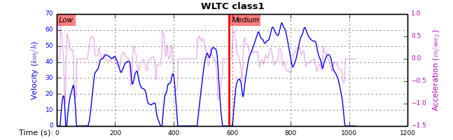
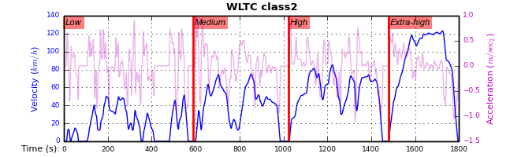

#############################
*wltp* gear-shifts calculator
#############################
|dev-status| |build-status| |cover-status| |docs-status| |pypi-status| |downloads-count| |github-issues|

:release:       0.0.9-alpha.5
:date:          2017-02-07 05:04:11
:documentation: https://wltp.readthedocs.org/
:source:        https://github.com/ankostis/wltp
:pypi-repo:     https://pypi.python.org/pypi/wltp
:keywords:      UNECE, automotive, car, cars, driving, engine, fuel-consumption, gears, gearshifts,
                rpm, simulation, simulator, standard, vehicle, vehicles, wltc, nedc
:Copyright:     2013-2014 European Commission (`JRC-IET <https://ec.europa.eu/jrc/en/institutes/iet>`_)
:License:       `EUPL 1.1+ <https://joinup.ec.europa.eu/software/page/eupl>`_

The *wltp* is a python package that calculates the *gear-shifts* of Light-duty vehicles running the :term:`WLTP`
driving-cycles, according to :term:`UNECE`'s :abbr:`GTR (Global Technical Regulation)` draft.

.. figure:: docs/wltc_class3b.png
    :align: center

    **Figure 1:** *WLTP cycle for class-3b Vehicles*

.. Attention:: This *wltp* python project is still in *alpha* stage.  Its results are not
    considered "correct", and no experimental procedures should rely currently on them.

    Some of the known deficiencies are described in these places:

    * In the :doc:`CHANGES`.
    * Presented in the diagrams of the :doc:`metrics` section.
    * Imprinted in the :mod:`~wltp.test.wltp_db_tests` test-case
      (automatically comparared with a pre-determined set of vehicles from Heinz-db on each build)
      Currently, mean rpm differ from Heinz-db < 0.5% and gears diff < 5% for a 1800-step class-3 cycle.

.. _end-opening:
.. contents:: Table of Contents
  :backlinks: top
.. _begin-intro:

Introduction
============

Overview
--------
The calculator accepts as input the vehicle's technical data, along with parameters for modifying the execution
of the :term:`WLTC` cycle, and it then spits-out the gear-shifts of the vehicle, the attained speed-profile,
and any warnings.  It does not calculate any |CO2| emissions.

An "execution" or a "run" of an experiment is depicted in the following diagram::

               .---------------------.                         .----------------------------.
              ;   Input-DataModel   ;                         ;      Output-DataModel       ;
             ;---------------------;                         ;----------------------------;
            ; +--vehicle          ;     ____________        ; +---...                    ;
           ;  +--params          ;     |            |      ;  +--cycle_run:             ;
          ;       +--wltc_data  ;  ==> |   Cycle    | ==> ;      t  v_class gear ...   ;
         ;                     ;       | Generator  |    ;      --------------------  ;
        ;                     ;        |____________|   ;       00      0.0    1     ;
       ;                     ;                         ;        01      1.3    1    ;
      ;                     ;                         ;         02      5.5    1   ;
     ;                     ;                         ;          ...               ;
    '---------------------'                         '----------------------------.

The *Input & Output DataModels* are instances of :dfn:`pandas-model`, trees of strings and numbers, assembled with:

- sequences,
- dictionaries,
- :class:`pandas.DataFrame`,
- :class:`pandas.Series`, and
- URI-references to other model-trees.

Quick-start
-----------

.. Note::
    The program runs on **Python-2.7+** and **Python-3.3+** (preferred) and requires
    **numpy/scipy**, **pandas** and **win32** libraries along with their *native backends* to be installed.
    If you do not have such an environment already installed, please read :doc:`install` section below for
    suitable distributions such as |winpython|_ or |anaconda|_.

Assuming that you have a working python-environment, open a *command-shell*,
(in *Windows* use :program:`cmd.exe` BUT ensure :program:`python.exe` is in its :envvar:`PATH`),
you can try the following commands:

.. Tip::
    The commands beginning with ``$``, below, imply a *Unix* like operating system with a *POSIX* shell
    (*Linux*, *OS X*). Although the commands are simple and easy to translate in its *Windows* ``cmd.exe`` counterpart,
    it would be worthwile to install `Cygwin <https://www.cygwin.com/>`_ to get the same environment on *Windows*.
    If you choose to do that, include also the following packages in the *Cygwin*'s installation wizard::

        * git, git-completion
        * make, zip, unzip, bzip2
        * openssh, curl, wget

    But do not install/rely on cygwin's outdated python environment.

:Install:
    .. code-block:: bash

        $ pip install wltp                      ## Use `--pre` if version-string has a build-suffix.
        $ wltp --winmenus                       ## Adds StartMenu-items, Windows only.

    Or in case you need the very latest from `master` branch :

    .. code-block:: bash

        $ pip install git+git://github.com/ankostis/wltp.git@master --pre

    See: :doc:`install`

:Cmd-line:
    .. code-block:: bash

        $ wltp --version
        0.0.9-alpha.5

        $ wltp --help
        ...

    See: :ref:`cmd-line-usage`

:GUI:
    .. code-block:: bash

        $ wltp --gui`                           ## For exploring model, but not ready yet.

:Excel:
    .. code-block:: bash

        $ wltp --excelrun                       ## Windows & OS X only

    See: :ref:`excel-usage`

:Python-code:
    .. code-block:: python

        from wltp.experiment import Experiment

        input_model = { ... }           ## See also "Python Usage" for model contents.
        exp = Experiment(input_model)
        output_model = exp.run()
        print('Results: \n%s' % output_model['cycle_run'])

    See: :ref:`python-usage`

.. _wltp-install:

Install
=======
Current version(|version|) runs on **Python-2.7+** and **Python-3.3+** and requires
**numpy/scipy**, **pandas** and **win32** libraries along with their *native backends* to be installed.

It has been tested under *Windows* and *Linux* and *Python-3.3+* is the preferred interpreter,
i.e, the *Excel* interface and desktop-UI runs only with it.

It is distributed on `Wheels <https://pypi.python.org/pypi/wheel>`_.

Python installation
-------------------

.. Warning::
    On *Windows* it is strongly suggested **NOT to install the standard CPython distribution**,
    unless:

    a) you have *administrative priviledges*,
    b) you are an experienced python programmer, so that
    c) you know how to hunt dependencies from *PyPi* repository and/or
       the `Unofficial Windows Binaries for Python Extension Packages <http://www.lfd.uci.edu/~gohlke/pythonlibs/>`_.

As explained above, this project depends on packages with *native-backends* that require the use
of *C* and *Fortran* compilers to build from sources.
To avoid this hassle, you should choose one of the user-friendly distributions suggested below.

Below is a matrix of the two suggested self-wrapped python distributions for running this program
(we excluded here default *python* included in *linux*). Both distributions:

- are free (as of freedom),
- do not require *admin-rights* for installation in *Windows*, and
- have been tested to run successfully this program (also tested on default *linux* distros).

+-----------------+-------------------------------------------+-------------------------------------------+
| *Distributions* | |winpython|_                              | |anaconda|_                               |
|                 |                                           |                                           |
+=================+===========================================+===========================================+
| *Platform*      | **Windows**                               | **Windows**, **Mac OS**, **Linux**        |
+-----------------+-------------------------------------------+-------------------------------------------+
| *Ease of*       | Fair                                      | - *Anaconda:* Easy                        |
|                 |                                           | - *MiniConda:* Moderate                   |
|                 | Currently (March-2015) it                 |                                           |
|                 | requires fiddling with the                |                                           |
| *Installation*  | :envvar:`PATH` after install.             |                                           |
|                 |                                           |                                           |
|                 |                                           |                                           |
+-----------------+-------------------------------------------+-------------------------------------------+
| *Ease of Use*   | Easy                                      | Moderate                                  |
|                 |                                           |                                           |
|                 |                                           | Should use :command:`conda` and/or        |
|                 |                                           | :command:`pip`                            |
|                 |                                           | depending on whether a package            |
|                 |                                           | contains native libraries                 |
|                 |                                           |                                           |
+-----------------+-------------------------------------------+-------------------------------------------+
| *# of Packages* | Only what's included in the               | Many 3rd-party packages                   |
|                 | downloaded-archive                        | uploaded by users                         |
|                 |                                           |                                           |
|                 |                                           |                                           |
+-----------------+-------------------------------------------+-------------------------------------------+
| *Notes*         | After installation, see `faq` for:        | - Check also the lighter `miniconda       |
|                 |                                           |   <http://conda.pydata.org/               |
|                 | - Registering WinPython installation      |   miniconda.html>`_.                      |
|                 | - Adding your installation in             | - For installing native-dependencies      |
|                 |   :envvar:`PATH`                          |   with :command:`conda` see files:        |
|                 |                                           |   - :file:`requirements/miniconda.txt`    |
|                 |                                           |   - :file:`.travis.yaml`                  |
|                 |                                           |                                           |
+-----------------+-------------------------------------------+-------------------------------------------+
|                 | Check also installation instructions from `the  pandas site                           |
|                 | <http://pandas.pydata.org/pandas-docs/stable/install.html>`_.                         |
|                 |                                                                                       |
+-----------------+-------------------------------------------+-------------------------------------------+

Package installation
--------------------

Before installing it, make sure that there are no older versions left over
on the python installation you are using.
To cleanly uninstall it, run this command until you cannot find any project installed:

.. code-block:: bash

    $ pip uninstall wltp                        ## Use `pip3` if both python-2 & 3 are in PATH.

You can install the project directly from the |pypi|_ the "standard" way,
by typing the :command:`pip` in the console:

  .. code-block:: bash

      $ pip install wltp

- If you want to install a *pre-release* version (the version-string is not plain numbers, but
  ends with ``alpha``, ``beta.2`` or something else), use additionally :option:`--pre`.

.. code-block:: bash

    $ pip install wltp

- Also you can install the very latest version straight from the sources:

  .. code-block:: bash

      $ pip install git+git://github.com/ankostis/wltp.git  --pre

- If you want to upgrade an existing instalation along with all its dependencies,
  add also :option:`--upgrade` (or :option:`-U` equivalently), but then the build might take some
  considerable time to finish.  Also there is the possibility the upgraded libraries might break
  existing programs(!) so use it with caution, or from within a |virtualenv|_.

- To install it for different Python environments, repeat the procedure using
  the appropriate :program:`python.exe` interpreter for each environment.

- .. Tip::
    To debug installation problems, you can export a non-empty :envvar:`DISTUTILS_DEBUG`
    and *distutils* will print detailed information about what it is doing and/or
    print the whole command line when an external program (like a C compiler) fails.

After installation, it is important that you check which version is visible in your :envvar:`PATH`:

.. code-block:: bash

    $ wltp --version
    0.0.9-alpha.5

To install for different Python versions, repeat the procedure for every required version.

Older versions
--------------
An additional purpose of the versioning schema of the project is to track which specific version
of the GTR it implements.
Given a version number ``MAJOR.MINOR.PATCH``, the ``MAJOR`` part tracks the GTR phase implemented.
See the "GTR version matrix" section in :doc:`CHANGES` for the mapping of MAJOR-numbers to GTR versions.

To install an older released version issue the console command:

.. code-block:: bash

    $ pip install wltp=1.1.1                    ## Use `--pre` if version-string has a build-suffix.

or alternatively straight from the sources:

.. code-block:: bash

    $ pip install git+git://github.com/ankostis/wltp.git@v0.0.9-alpha.3.1  --pre

Ofcourse you can substitute `v0.0.9-alpha.3.1` with any slug from "commits", "branches" or "releases"
that you will find on project's `github-repo <https://github.com/ankostis/wltp>`_).

.. Note::
    If you have another version already installed, you have to use :option:`--ignore-installed` (or :option:`-I`).
    For using the specific version, check this (untested)
    `stackoverflow question <http://stackoverflow.com/questions/6445167/force-python-to-use-an-older-version-of-module-than-what-i-have-installed-now>`_ .

    You can install each version in a separate |virtualenv|_ and shy away from all this.
    Check

Installing from sources
-----------------------
If you download the sources you have more options for installation.
There are various methods to get hold of them:

* Download the *source* distribution from |pypi|_.
* Download a `release-snapshot from github <https://github.com/ankostis/wltp/releases>`_
* Clone the *git-repository* at *github*.

  Assuming you have a working installation of `git <http://git-scm.com/>`_
  you can fetch and install the latest version of the project with the following series of commands:

  .. code-block:: bash

      $ git clone "https://github.com/ankostis/wltp.git" wltp.git
      $ cd wltp.git
      $ python setup.py install                                 ## Use `python3` if both python-2 & 3 installed.

When working with sources, you need to have installed all libraries that the project depends on:

.. code-block:: bash

    $ pip install -r requirements/execution.txt .

The previous command installs a "snapshot" of the project as it is found in the sources.
If you wish to link the project's sources with your python environment, install the project
in `development mode <http://pythonhosted.org/setuptools/setuptools.html#development-mode>`_:

.. code-block:: bash

    $ python setup.py develop

.. Note:: This last command installs any missing dependencies inside the project-folder.

Project files and folders
-------------------------
The files and folders of the project are listed below::

    +--wltp/            ## (package) The python-code of the calculator
    |   +--cycles/      ## (package) The python-code for the WLTC data
    |   +--test/        ## (package) Test-cases and the wltp_db
    |   +--model        ## (module) Describes the data and their schema for the calculation
    |   +--experiment   ## (module) The calculator
    |   +--plots        ## (module) Diagram-plotting code and utilities
    +--docs/            ## Documentation folder
    |   +--pyplots/     ## (scripts) Plot the metric diagrams embeded in the README
    +--devtools/        ## (scripts) Preprocessing of WLTC data on GTR and the wltp_db
    |   +--run_tests.sh ## (script) Executes all TestCases
    +--setup.py         ## (script) The entry point for `setuptools`, installing, testing, etc
    +--requirements/    ## (txt-files) Various pip-dependencies for tools.
    +--README.rst
    +--CHANGES.rst
    +--LICENSE.txt

.. _wltp-usage:

Usage
=====
.. _cmd-line-usage:

Cmd-line usage
--------------
.. Warning:: Not implemented in yet.

The command-line usage below requires the Python environment to be installed, and provides for
executing an experiment directly from the OS's shell (i.e. :program:`cmd` in windows or :program:`bash` in POSIX),
and in a *single* command.  To have precise control over the inputs and outputs
(i.e. experiments in a "batch" and/or in a design of experiments)
you have to run the experiments using the API python, as explained below.

The entry-point script is called :program:`wltp`, and it must have been placed in your :envvar:`PATH`
during installation.  This script can construct a *model* by reading input-data
from multiple files and/or overriding specific single-value items. Conversely,
it can output multiple parts of the resulting-model into files.

To get help for this script, use the following commands:

.. code-block:: bash

    $ wltp --help                               ## to get generic help for cmd-line syntax
    $ wltcmdp.py -M vehicle/full_load_curve     ## to get help for specific model-paths

and then, assuming ``vehicle.csv`` is a CSV file with the vehicle parameters
for which you want to override the ``n_idle`` only, run the following:

.. code-block:: bash

    $ wltp -v \
        -I vehicle.csv file_frmt=SERIES model_path=params header@=None \
        -m vehicle/n_idle:=850 \
        -O cycle.csv model_path=cycle_run

GUI usage
---------
.. Attention:: Desktop UI requires Python 3!

For a quick-'n-dirty method to explore the structure of the model-tree and run an experiment,
just run:

.. code-block:: bash

    $ wltp --gui

.. _excel-usage:

Excel usage
-----------
.. Attention:: Excel-integration requires Python 3 and *Windows* or *OS X*!

In *Windows* and *OS X* you may utilize the excellent `xlwings <http://xlwings.org/quickstart/>`_ library
to use Excel files for providing input and output to the experiment.

To create the necessary template-files in your current-directory you should enter:

.. code-block:: console

     $ wltp --excel

You could type instead :samp:`wltp --excel {file_path}` to specify a different destination path.

In *windows*/*OS X* you can type :samp:`wltp --excelrun` and the files will be created in your home-directory
and the excel will open them in one-shot.

All the above commands creates two files:

:file:`wltp_excel_runner.xlsm`
    The python-enabled excel-file where input and output data are written, as seen in the screenshot below:

    .. image:: docs/xlwings_screenshot.png
        :scale: 50%
        :alt: Screenshot of the `wltp_excel_runner.xlsm` file.

    After opening it the first tie, enable the macros on the workbook, select the python-code at the left and click
    the :menuselection:`Run Selection as Pyhon` button; one sheet per vehicle should be created.

    The excel-file contains additionally appropriate *VBA* modules allowing you to invoke *Python code*
    present in *selected cells* with a click of a button, and python-functions declared in the python-script, below,
    using the `mypy` namespace.

    To add more input-columns, you need to set as column *Headers* the *json-pointers* path of the desired
    model item (see :ref:`python-usage` below,).

:file:`wltp_excel_runner.py`
    Utility python functions used by the above xls-file for running a batch of experiments.

    The particular functions included reads multiple vehicles from the input table with various
    vehicle characteristics and/or experiment parameters, and then it adds a new worksheet containing
    the cycle-run of each vehicle .
    Of course you can edit it to further fit your needs.

.. Note:: You may reverse the procedure described above and run the python-script instead.
    The script will open the excel-file, run the experiments and add the new sheets, but in case any errors occur,
    this time you can debug them, if you had executed the script through *LiClipse*, or *IPython*!

Some general notes regarding the python-code from excel-cells:

* On each invocation, the predefined VBA module `pandalon` executes a dynamically generated python-script file
  in the same folder where the excel-file resides, which, among others, imports the "sister" python-script file.
  You can read & modify the sister python-script to import libraries such as 'numpy' and 'pandas',
  or pre-define utility python functions.
* The name of the sister python-script is automatically calculated from the name of the Excel-file,
  and it must be valid as a python module-name.  Therefore do not use non-alphanumeric characters such as
  spaces(` `), dashes(`-`) and dots(`.`) on the Excel-file.
* On errors, a log-file is written in the same folder where the excel-file resides,
  for as long as **the message-box is visible, and it is deleted automatically after you click 'ok'!**
* Read http://docs.xlwings.org/quickstart.html

.. _python-usage:

Python usage
------------
Example python :abbr:`REPL (Read-Eval-Print Loop)` example-commands  are given below
that setup and run an *experiment*.

First run :command:`python` or :command:`ipython` and try to import the project to check its version:

.. doctest::

    >>> import wltp

    >>> wltp.__version__            ## Check version once more.
    '0.0.9-alpha.5'

    >>> wltp.__file__               ## To check where it was installed.         # doctest: +SKIP
    /usr/local/lib/site-package/wltp-...

.. Tip:
    The use :command:`ipython` is preffered over :command:`python` since it offers various user-friendly
    facilities, such as pressing :kbd:`Tab` for completions, or allowing you to suffix commands with `?` or `??`
    to get help and read their source-code.

    Additionally you can <b>copy any python commands starting with ``>>>`` and ``...``</b> and copy paste them directly
    into the ipython interpreter; it will remove these prefixes.
    But in :command:`python` you have to remove it youself.

If everything works, create the :term:`pandas-model` that will hold the input-data (strings and numbers)
of the experiment.  You can assemble the model-tree by the use of:

* sequences,
* dictionaries,
* :class:`pandas.DataFrame`,
* :class:`pandas.Series`, and
* URI-references to other model-trees.

For instance:

.. doctest::

    >>> from wltp import model
    >>> from wltp.experiment import Experiment
    >>> from collections import OrderedDict as odic         ## It is handy to preserve keys-order.

    >>> mdl = odic(
    ...   vehicle = odic(
    ...     unladen_mass = 1430,
    ...     test_mass    = 1500,
    ...     v_max        = 195,
    ...     p_rated      = 100,
    ...     n_rated      = 5450,
    ...     n_idle       = 950,
    ...     n_min        = None,                            ## Manufacturers my overridde it
    ...     gear_ratios         = [120.5, 75, 50, 43, 37, 32],
    ...     resistance_coeffs   = [100, 0.5, 0.04],
    ...   )
    ... )

For information on the accepted model-data, check its :term:`JSON-schema`:

.. doctest::

    >>> model.json_dumps(model.model_schema(), indent=2)                                # doctest: +SKIP
    {
      "properties": {
        "params": {
          "properties": {
            "f_n_min_gear2": {
              "description": "Gear-2 is invalid when N :< f_n_min_gear2 * n_idle.",
              "type": [
                "number",
                "null"
              ],
              "default": 0.9
            },
            "v_stopped_threshold": {
              "description": "Velocity (Km/h) under which (<=) to idle gear-shift (Annex 2-3.3, p71).",
              "type": [
    ...

You then have to feed this model-tree to the :class:`~wltp.experiment.Experiment`
constructor. Internally the :class:`~wltp.pandel.Pandel` resolves URIs, fills-in default values and
validates the data based on the project's pre-defined JSON-schema:

.. doctest::

    >>> processor = Experiment(mdl)         ## Fills-in defaults and Validates model.

Assuming validation passes without errors, you can now inspect the defaulted-model
before running the experiment:

.. doctest::

    >>> mdl = processor.model               ## Returns the validated model with filled-in defaults.
    >>> sorted(mdl)                         ## The "defaulted" model now includes the `params` branch.
    ['params', 'vehicle']
    >>> 'full_load_curve' in mdl['vehicle'] ## A default wot was also provided in the `vehicle`.
    True

Now you can run the experiment:

.. doctest::

    >>> mdl = processor.run()               ## Runs experiment and augments the model with results.
    >>> sorted(mdl)                         ## Print the top-branches of the "augmented" model.
    ['cycle_run', 'params', 'vehicle']

To access the time-based cycle-results it is better to use a :class:`pandas.DataFrame`:

.. doctest::

    >>> import pandas as pd
    >>> df = pd.DataFrame(mdl['cycle_run']); df.index.name = 't'
    >>> df.shape                            ## ROWS(time-steps) X COLUMNS.
    (1801, 11)
    >>> df.columns
    Index(['v_class', 'v_target', 'clutch', 'gears_orig', 'gears', 'v_real', 'p_available', 'p_required', 'rpm', 'rpm_norm', 'driveability'], dtype='object')
    >>> 'Mean engine_speed: %s' % df.rpm.mean()
    'Mean engine_speed: 1940.72109939'
    >>> df.describe()
               v_class     v_target     clutch   gears_orig        gears  \
    count  1801.000000  1801.000000       1801  1801.000000  1801.000000
    mean     46.506718    46.506718  0.0660744     3.794003     3.683509
    std      36.119280    36.119280  0.2484811     2.278959     2.278108
    ...
    <BLANKLINE>
                v_real  p_available   p_required          rpm     rpm_norm
    count  1801.000000  1801.000000  1801.000000  1801.000000  1801.000000
    mean     50.356222    28.846639     4.991915  1940.721099     0.214898
    std      32.336908    15.833262    12.139823   840.959339     0.195142
    ...

    >>> processor.driveability_report()                                             # doctest: +SKIP
    ...
      12: (a: X-->0)
      13: g1: Revolutions too low!
      14: g1: Revolutions too low!
    ...
      30: (b2(2): 5-->4)
    ...
      38: (c1: 4-->3)
      39: (c1: 4-->3)
      40: Rule e or g missed downshift(40: 4-->3) in acceleration?
    ...
      42: Rule e or g missed downshift(42: 3-->2) in acceleration?
    ...

You can export the cycle-run results in a CSV-file with the following pandas command:

.. code-block:: pycon

    >>> df.to_csv('cycle_run.csv')                                                      # doctest: +SKIP

For more examples, download the sources and check the test-cases
found under the :file:`/wltp/test/` folder.

IPython notebook usage
----------------------
The list of *IPython notebooks* for wltp is maintained at the `wiki <https://github.com/ankostis/wltp/wiki>`_
of the project.

Requirements
^^^^^^^^^^^^
In order to run them interactively, ensure that the following requirements are satisfied:

a. A `ipython-notebook server <http://ipython.org/notebook.html>`_ >= v2.x.x is installed for  *python-3*,
   it is up, and running.
b. The *wltp* is installed on your system (see :doc:`install` above).

Instructions
^^^^^^^^^^^^
* Visit each *notebook* from the wiki-list that you wish to run and **download** it as :file:`ipynb` file
  from the menu (:menuselection:`File|Download as...|IPython Notebook(.ipynb)`).
* Locate the downloaded file with your *file-browser* and **drag n' drop** it on the landing page
  of your notebook's server (the one with the folder-list).

Enjoy!

.. _begin-contribute:

Getting Involved
================
This project is hosted in **github**.
To provide feedback about bugs and errors or questions and requests for enhancements,
use `github's Issue-tracker <https://github.com/ankostis/wltp/issues>`_.

Sources & Dependencies
----------------------
To get involved with development, you need a POSIX environment to fully build it
(*Linux*, *OSX* or *Cygwin* on *Windows*).

First you need to download the latest sources:

.. code-block:: console

    $ git clone https://github.com/ankostis/wltp.git wltp.git
    $ cd wltp.git

.. Admonition:: Virtualenv
    :class: note

    You may choose to work in a |virtualenv|_,
    to install dependency libraries isolated from system's ones, and/or without *admin-rights*
    (this is recommended for *Linux*/*Mac OS*).

    .. Attention::
        If you decide to reuse stystem-installed packages using  :option:`--system-site-packages`
        with ``virtualenv <= 1.11.6``
        (to avoid, for instance, having to reinstall *numpy* and *pandas* that require native-libraries)
        you may be bitten by `bug #461 <https://github.com/pypa/virtualenv/issues/461>`_ which
        prevents you from upgrading any of the pre-installed packages with :command:`pip`.

.. Admonition:: Liclipse IDE
    :class: note

    Within the sources there are two sample files for the comprehensive
    `LiClipse IDE <http://www.liclipse.com/>`_:

    * :file:`eclipse.project`
    * :file:`eclipse.pydevproject`

    Remove the `eclipse` prefix, (but leave the dot(`.`)) and import it as "existing project" from
    Eclipse's `File` menu.

    Another issue is caused due to the fact that LiClipse contains its own implementation of *Git*, *EGit*,
    which badly interacts with unix *symbolic-links*, such as the :file:`docs/docs`, and it detects
    working-directory changes even after a fresh checkout.  To workaround this, Right-click on the above file
    :menuselection:`Properties --> Team --> Advanced --> Assume Unchanged`

Then you can install all project's dependencies in *`development mode* using the :file:`setup.py` script:

.. code-block:: console

    $ python setup.py --help                           ## Get help for this script.
    Common commands: (see '--help-commands' for more)

      setup.py build      will build the package underneath 'build/'
      setup.py install    will install the package

    Global options:
      --verbose (-v)      run verbosely (default)
      --quiet (-q)        run quietly (turns verbosity off)
      --dry-run (-n)      don't actually do anything
    ...

    $ python setup.py develop                           ## Also installs dependencies into project's folder.
    $ python setup.py build                             ## Check that the project indeed builds ok.

You should now run the test-cases (see :doc:`metrics`) to check
that the sources are in good shape:

.. code-block:: console

   $ python setup.py test

.. Note:: The above commands installed the dependencies inside the project folder and
    for the *virtual-environment*.  That is why all build and testing actions have to go through
    :samp:`python setup.py {some_cmd}`.

    If you are dealing with installation problems and/or you want to permantly install dependant packages,
    you have to *deactivate* the virtual-environment and start installing them into your *base*
    python environment:

    .. code-block:: console

       $ deactivate
       $ python setup.py develop

    or even try the more *permanent* installation-mode:

    .. code-block:: console

       $ python setup.py install                # May require admin-rights

Development procedure
---------------------
For submitting code, use ``UTF-8`` everywhere, unix-eol(``LF``) and set ``git --config core.autocrlf = input``.

The typical development procedure is like this:

1. Modify the sources in small, isolated and well-defined changes, i.e.
   adding a single feature, or fixing a specific bug.
2. Add test-cases "proving" your code.
3. Rerun all test-cases to ensure that you didn't break anything,
   and check their *coverage* remain above 80%:

   .. code-block:: console

        $ python setup.py nosetests --with-coverage --cover-package wltp.model,wltp.experiment --cover-min-percentage=80

   .. Tip:: You can enter just: ``python setup.py test_all`` instead of the above cmd-line
       since it has been *aliased* in the :file:`setup.cfg` file.
       Check this file for more example commands to use during development.

4. If you made a rather important modification, update also the :doc:`CHANGES` file and/or
   other documents (i.e. README.rst).  To see the rendered results of the documents,
   issue the following commands and read the result html at :file:`build/sphinx/html/index.html`:

   .. code-block:: console

        $ python setup.py build_sphinx                  # Builds html docs
        $ python setup.py build_sphinx -b doctest       # Checks if python-code embeded in comments runs ok.

5. If there are no problems, commit your changes with a descriptive message.

6. Repeat this cycle for other bugs/enhancements.
7. When you are finished, push the changes upstream to *github* and make a *merge_request*.
   You can check whether your merge-request indeed passed the tests by checking
   its build-status |build-status| on the integration-server's site (TravisCI).

   .. Hint:: Skim through the small IPython developer's documentantion on the matter:
        `The perfect pull request <https://github.com/ipython/ipython/wiki/Dev:-The-perfect-pull-request>`_

Specs & Algorithm
-----------------
This program was implemented from scratch based on
this :download:`GTR specification <23.10.2013 ECE-TRANS-WP29-GRPE-2013-13 0930.docx>`
(included in the :file:`docs/` folder).  The latest version of this GTR, along
with other related documents can be found at UNECE's site:

* http://www.unece.org/trans/main/wp29/wp29wgs/wp29grpe/grpedoc_2013.html
* https://www2.unece.org/wiki/pages/viewpage.action?pageId=2523179
* Probably a more comprehensible but older spec is this one:
  https://www2.unece.org/wiki/display/trans/DHC+draft+technical+report

The WLTC-profiles for the various classes in the :file:`devtools/data/cycles/` folder were generated from the tables
of the specs above using the :file:`devtools/csvcolumns8to2.py` script, but it still requires
an intermediate manual step involving a spreadsheet to copy the table into ands save them as CSV.

Then use the :file:`devtools/buildwltcclass.py` to construct the respective python-vars into the
:mod:`wltp/model.py` sources.

Data-files generated from Steven Heinz's ms-access ``vehicle info`` db-table can be processed
with the  :file:`devtools/preprocheinz.py` script.

Cycles
^^^^^^

.. image:: docs/wltc_class3a.png
    :align: center
.. image:: docs/wltc_class3b.png
    :align: center

.. _dev-team:

Development team
----------------

* Author:
    * Kostis Anagnostopoulos
* Contributing Authors:
    * Heinz Steven (test-data, validation and review)
    * Georgios Fontaras (simulation, physics & engineering support)
    * Alessandro Marotta (policy support)

.. _begin-glossary:

Glossary
========
.. glossary::

    WLTP
        The `Worldwide harmonised Light duty vehicles Test Procedure <https://www2.unece.org/wiki/pages/viewpage.action?pageId=2523179>`_,
        a :term:`GRPE` informal working group

    UNECE
        The United Nations Economic Commission for Europe, which has assumed the steering role
        on the :term:`WLTP`.

    GRPE
        :term:`UNECE` Working party on Pollution and Energy - Transport Programme

    GS Task-Force
        The Gear-shift Task-force of the :term:`GRPE`. It is the team of automotive experts drafting
        the gear-shifting strategy for vehicles running the :term:`WLTP` cycles.

    WLTC
        The family of pre-defined *driving-cycles* corresponding to vehicles with different
        :abbr:`PMR (Power to Mass Ratio)`. Classes 1,2, 3a & 3b are split in 2, 4, 4 and 4 *parts* respectively.

    Unladen mass
        *UM* or *Curb weight*, the weight of the vehicle in running order minus
        the mass of the driver.

    Test mass
        *TM*, the representative weight of the vehicle used as input for the calculations of the simulation,
        derived by interpolating between high and low values for the |CO2|-family of the vehicle.

    Downscaling
        Reduction of the top-velocity of the original drive trace to be followed, to ensure that the vehicle
        is not driven in an unduly high proportion of "full throttle".

    pandas-model
        The *container* of data that the gear-shift calculator consumes and produces.
        It is implemented by :class:`wltp.pandel.Pandel` as a mergeable stack of :term:`JSON-schema` abiding trees of
        strings and numbers, formed with sequences, dictionaries, :mod:`pandas`-instances and URI-references.

    JSON-schema
        The `JSON schema <http://json-schema.org/>`_ is an `IETF draft <http://tools.ietf.org/html/draft-zyp-json-schema-03>`_
        that provides a *contract* for what JSON-data is required for a given application and how to interact
        with it.  JSON Schema is intended to define validation, documentation, hyperlink navigation, and
        interaction control of JSON data.
        You can learn more about it from this `excellent guide <http://spacetelescope.github.io/understanding-json-schema/>`_,
        and experiment with this `on-line validator <http://www.jsonschema.net/>`_.

    JSON-pointer
        JSON Pointer(:rfc:`6901`) defines a string syntax for identifying a specific value within
        a JavaScript Object Notation (JSON) document. It aims to serve the same purpose as *XPath* from the XML world,
        but it is much simpler.

.. _begin-replacements:

.. |CO2| replace:: CO\ :sub:`2`

.. |virtualenv| replace::  *virtualenv* (isolated Python environment)
.. _virtualenv: http://docs.python-guide.org/en/latest/dev/virtualenvs/

.. |pypi| replace:: *PyPi* repo
.. _pypi: https://pypi.python.org/pypi/wltp

.. |winpython| replace:: *WinPython*
.. _winpython: http://winpython.github.io/

.. |anaconda| replace:: *Anaconda*
.. _anaconda: http://docs.continuum.io/anaconda/

.. |build-status| image:: https://travis-ci.org/ankostis/wltp.svg
    :alt: Integration-build status
    :scale: 100%
    :target: https://travis-ci.org/ankostis/wltp/builds

.. |cover-status| image:: https://coveralls.io/repos/ankostis/wltp/badge.png?branch=master
    :target: https://coveralls.io/r/ankostis/wltp?branch=master

.. |docs-status| image:: https://readthedocs.org/projects/wltp/badge/
    :alt: Documentation status
    :scale: 100%
    :target: https://readthedocs.org/builds/wltp/

.. |pypi-status| image::  https://pypip.in/v/wltp/badge.png
    :target: https://pypi.python.org/pypi/wltp/
    :alt: Latest Version in PyPI

.. |python-ver| image:: https://pypip.in/py_versions/wltp/badge.svg
    :target: https://pypi.python.org/pypi/wltp/
    :alt: Supported Python versions

.. |dev-status| image:: https://pypip.in/status/wltp/badge.svg
    :target: https://pypi.python.org/pypi/wltp/
    :alt: Development Status

.. |downloads-count| image:: https://pypip.in/download/wltp/badge.svg?period=week
    :target: https://pypi.python.org/pypi/wltp/
    :alt: Downloads

.. |github-issues| image:: http://img.shields.io/github/issues/ankostis/wltp.svg
    :target: https://github.com/ankostis/wltp/issues
    :alt: Issues count
